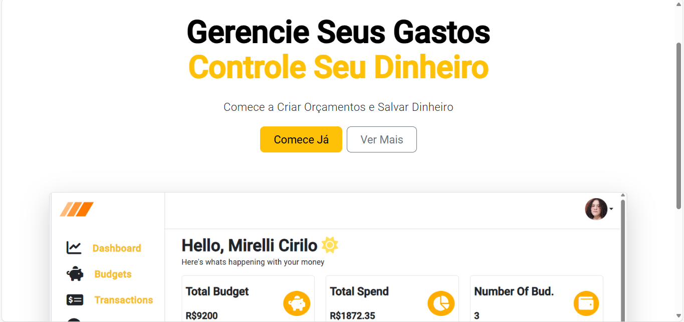
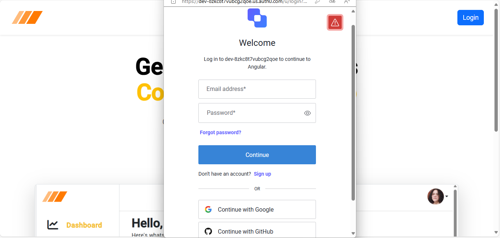
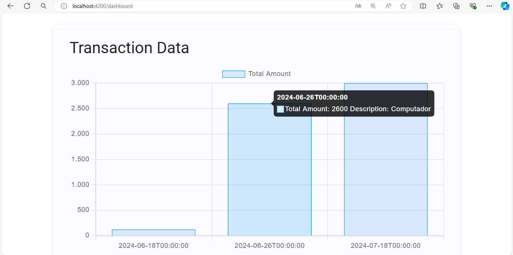
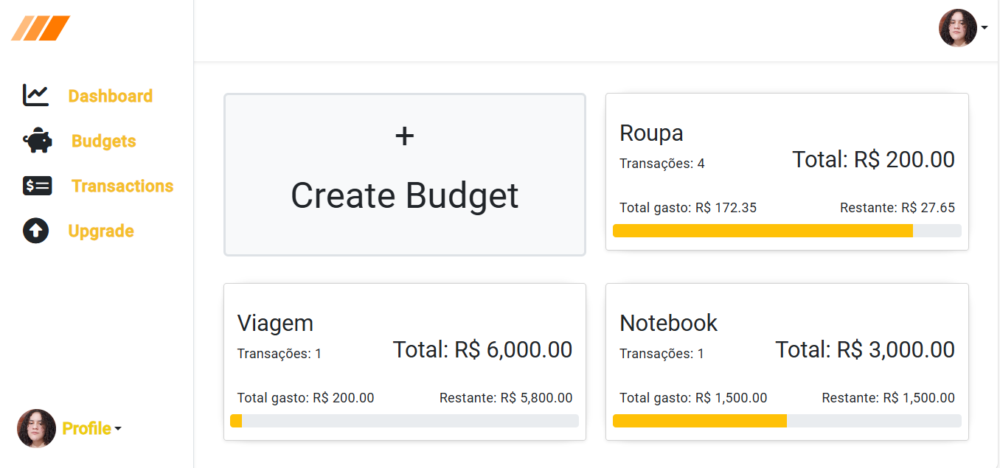
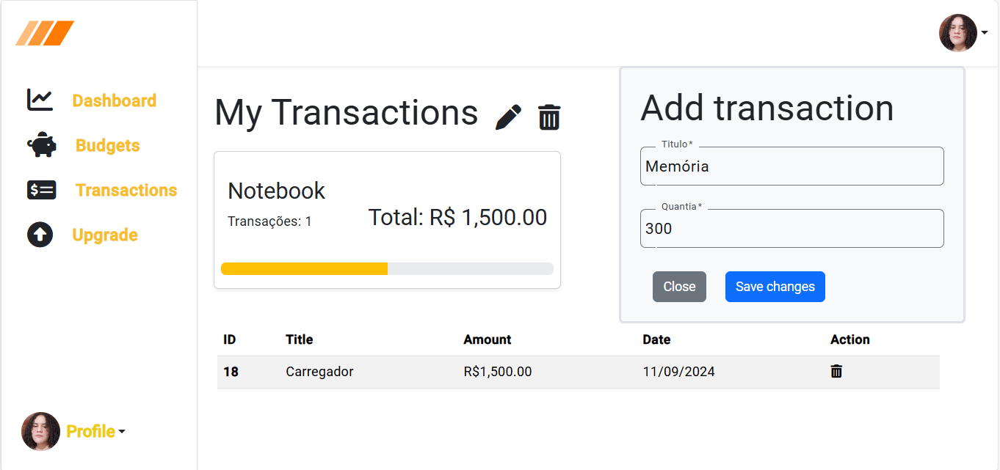

# Projeto de Gerenciamento Financeiro

## Descrição
Este projeto é um aplicativo fullstack para gerenciamento financeiro. Ele inclui funcionalidades de CRUD para transações e orçamentos, além de um dashboard interativo.
O backend é desenvolvido em C# com ASP.NET e Entity Framework. O frontend é desenvolvido em Angular e utiliza Angular Material, Chart.js para gráficos e 
Swagger para documentação da API. Para autenticação de usuário está sendo utilizado o auth0.

## Demonstração

### Home


### Auth


### Dashboard


### Budgets


### Transactions


## Tecnologias Utilizadas

### Backend
- ASP.NET Core
- Entity Framework
- Swagger

### Frontend
- Angular
- Angular Material
- Chart.js

## Instalação

### Pré-requisitos
- [.NET Core SDK](https://dotnet.microsoft.com/download)
- [Node.js](https://nodejs.org/)
- [Angular CLI](https://angular.io/cli)

### Clonando o Repositório
```sh
git clone https://github.com/Mirelli-Cirilo/FinancialManagementApp.git
cd FinancialManagementApp


- Restaure as dependências e compile o projeto
dotnet restore
dotnet build

- Atualize o banco de dados usando Entity Framework Migrations
dotnet ef database update

- Inicie o servidor
dotnet run
